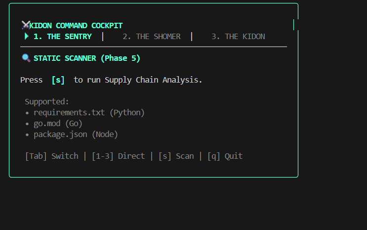
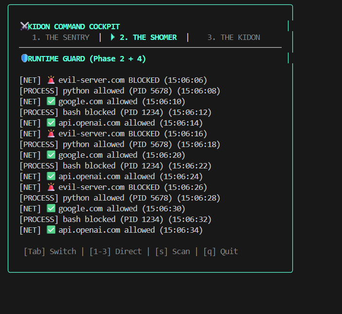
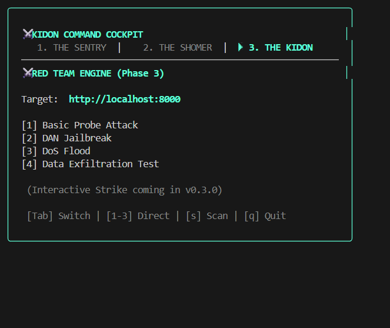

# ⚔️ KIDON (כידון)
> **Agentic Cyber Defense Platform** // Powered by Cilium eBPF

[](https://opensource.org/licenses/MIT)
[](https://github.com/uddeshya-23/-kidon-security)
[](https://ebpf.io)
[](https://owasp.org/www-project-top-10-for-large-language-model-applications/)

**Kidon** (Hebrew for "Javelin") is the first open-source security platform designed to bind the "Titans"—Autonomous AI Agents. It provides **Runtime Kernel Protection** using eBPF technology, **Supply Chain Intelligence**, and a **Unified Command Cockpit**.

---

## 🖥️ The Command Cockpit (NEW in v0.3.0)

A cyberpunk, keyboard-driven terminal interface that unifies all security operations.







```bash
./kidon dashboard
```

---

## 🛡️ The Titan Defense Architecture

| Module | Code Name | Function | Tech Stack | OWASP Coverage |
| :--- | :--- | :--- | :--- | :--- |
| **Scanner** | *The Sentry* | Static Analysis + Supply Chain | Go, Regex, OSV.dev | ASI-03, ASI-04, ASI-07 |
| **Guard** | *The Shomer* | Runtime Kernel Watchdog | **Cilium eBPF**, C, Docker | ASI-02, ASI-05, ASI-10 |
| **Strike** | *The Kidon* | Offensive Red Teaming Engine | Go, Ollama (Local SLM) | ASI-01, ASI-06, ASI-08 |
| **Network** | *Iron Dome* | Network Egress Filtering | eBPF cgroup hooks | ASI-02, ASI-09 |
| **Cockpit** | *Command* | Unified TUI Dashboard | Bubble Tea, Lipgloss | All |

---

## 🚀 Quick Start

### Installation

```bash
git clone https://github.com/uddeshya-23/-kidon-security
cd -kidon-security
go build -o kidon cmd/kidon/main.go
```

### Commands

| Command | Description |
|---------|-------------|
| `./kidon dashboard` | Launch the Command Cockpit TUI |
| `./kidon scan ./path` | Run Static + Supply Chain scan |
| `./kidon guard --network` | Start eBPF Runtime Guard |
| `./kidon strike -t URL --ai` | Launch AI-powered red team attack |
| `./kidon report` | Generate mission report |

---

## 📦 Supply Chain Intelligence ("The Gatekeeper")

Automatically detects vulnerable dependencies using OSV.dev:

```bash
./kidon scan ./my-agent-repo

⚔️  KIDON STATIC SCANNER
📦 Analyzing supply chain dependencies...
   Found 4 packages to check
   ⚠ Found 74 vulnerable dependencies!

[CRITICAL] requests@2.0.0 - CVE-2018-18074
[CRITICAL] flask@0.12 - GHSA-562c-5r94
[CRITICAL] django@1.11.0 - 36 vulnerabilities!
```

**Supported:** `requirements.txt` (Python), `go.mod` (Go), `package.json` (Node)

---

## 🐝 Powered by Cilium eBPF

Kidon leverages the **`cilium/ebpf`** library for kernel-level protection:

* **Process Guard:** Hooks `sys_enter_execve` to block unauthorized shells
* **Network Fortress:** Uses `cgroup/connect4` to filter egress connections
* **Iron Dome:** Blocks all IPv6 as fail-safe protection

---

## 🔧 Development Roadmap

**Current Version:** v0.3.0 ("The Command Update")

- [x] **Phase 1:** Static Credential Scanner
- [x] **Phase 2:** Runtime Process Guard (eBPF)
- [x] **Phase 3:** Red Teaming Engine (Ollama)
- [x] **Phase 4:** Network Guard (Experimental)
- [x] **Phase 5:** Supply Chain Scanner (OSV.dev)
- [x] **Phase 6:** Command Cockpit (Bubble Tea TUI)
- [ ] **Phase 7:** Kubernetes Operator

---

## 📝 License

MIT License - See [LICENSE](LICENSE) for details.

---

*Built for the Age of Agentic AI.*
